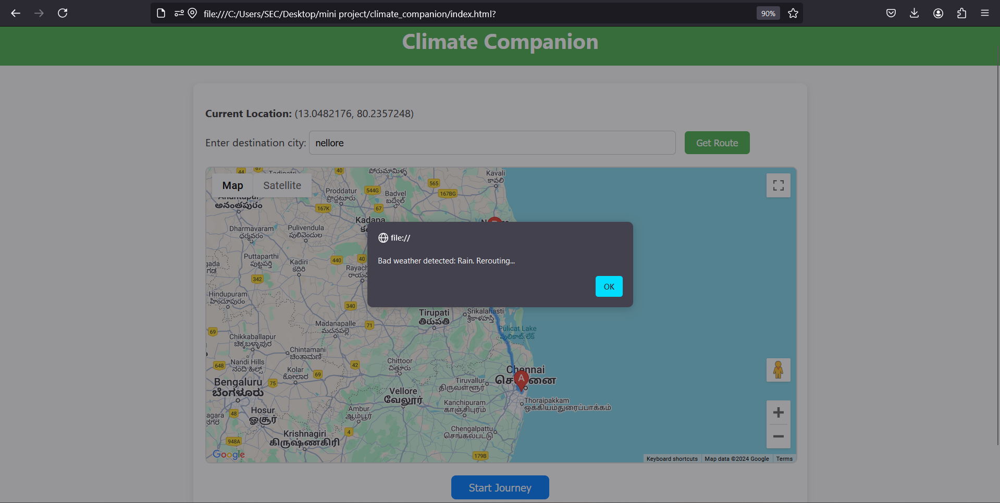

## CLIMATE COMPANION
The Climate Companion project aims to enhance road safety and travel efficiency by integrating real-time weather data with navigation systems. It allows users to plan routes that avoid adverse weather conditions, like rain, thunderstorms, and snow, ensuring safer journeys. By offering dynamic rerouting based on changing weather patterns, it not only improves driving comfort but also helps drivers reach their destinations with minimal disruptions.

## About
<!--Detailed Description about the project-->
The Climate Companion project is an innovative navigation system that integrates real-time weather data to enhance driving safety and optimize travel routes. By analyzing weather conditions such as temperature, precipitation, and wind speed, it dynamically adjusts routes to help drivers avoid adverse weather. The system features an intuitive user interface, allowing users to input destinations and receive updated route suggestions based on changing weather patterns. Utilizing a combination of advanced APIs for weather and mapping, it ensures seamless integration and real-time notifications for users. Ultimately, the project aims to improve road safety, enhance user experience, and promote efficient travel.

## Features
<!--List the features of the project as shown below-->
The Climate Companion project offers several features aimed at optimizing travel by integrating weather data with navigation systems. Here’s a list of its core features:

1. Weather-Integrated Route Planning:
Provides real-time weather information and incorporates it into the navigation system, suggesting the safest and most efficient route based on current weather conditions.
2. Dynamic Route Updates:
Continuously monitors weather changes during a trip and adjusts the route in real-time, ensuring drivers avoid hazardous conditions like storms, heavy rain, or snow.
3. Weather Alerts:
Sends notifications and alerts about sudden or severe weather changes, like thunderstorms, floods, or extreme temperatures, that could affect the journey.
4. User-Specific Route Suggestions:
Allows users to set preferences based on their starting point, destination, and preferred weather conditions, offering personalized travel suggestions.
5. Map Integration:
Integrates seamlessly with Google Maps or OpenStreetMap, displaying both the route and live weather overlays on the map.
6. Safe Route Visualization:
Highlights safe routes on the map using color codes or visual indicators that reflect weather severity, making it easy to distinguish between safe and risky paths.

## Requirements
<!--List the requirements of the project as shown below-->
The Climate Companion project requirements can be categorized into hardware, software, and data needs:

1. Hardware Requirements:
GPS-enabled device (e.g., smartphones or car navigation systems) to track real-time location.
Internet connectivity for accessing live weather updates and map services.
Server or Cloud infrastructure to handle weather data processing and routing algorithms.
2. Software Requirements:
Operating System: Windows, macOS, or Linux (for development).
IDE: VS Code or any Python-supported Integrated Development Environment.
Programming Language: Python (for backend processing and integration).
Web Framework: Flask/Django (for developing the web interface).
Mapping API: Google Maps API or OpenStreetMap for routing.
Weather API: OpenWeatherMap or other similar services for real-time weather data.
Database: MySQL or PostgreSQL for storing user information, weather logs, and route history.
3. Data Requirements:
Weather data: Real-time weather information such as temperature, wind speed, precipitation, and visibility.
Geographical data: Maps, routes, and traffic conditions from services like Google Maps or OpenStreetMap.
User data: Basic user information for personalization and tracking, including location preferences, and destination inputs.
4. Functional Requirements:
User Interface: A user-friendly interface for inputting destinations and displaying routes.
Real-time Route Suggestions: Display routes with adjustments based on weather conditions.
Weather Alerts: Notifications on sudden weather changes or unsafe travel conditions.
5. Non-Functional Requirements:
Scalability: Ability to handle multiple users and locations simultaneously.
Performance: Real-time route updates and low-latency weather data processing.
Reliability: Consistent weather updates and route accuracy during trips.

## System Architecture
<!--Embed the system architecture diagram as shown below-->

## Output

<!--Embed the Output picture at respective places as shown below as shown below-->
#### Output1 - user interface of the application

#### Output2 - working model of the application

## Results and Impact
<!--Give the results and impact as shown below-->
The Climate Companion project successfully integrates real-time weather data with navigation systems, significantly enhancing travel safety and efficiency. The system's ability to dynamically update routes based on changing weather conditions ensures that drivers avoid hazardous weather such as heavy rain, snow, or storms. As a result, users experience fewer delays and reduced risks of accidents related to poor weather conditions. The project also provides personalized travel suggestions and proactive weather alerts, improving both user convenience and road safety. Overall, Climate Companion's real-time data processing and route optimization lead to smoother journeys, reduced travel time, and increased peace of mind for drivers, especially in regions prone to extreme weather conditions.

## Books published / References
1. "Intelligent Transport Systems: Technologies and Applications" by Asier Perallos, Unai Hernandez-Jayo, Enrique Onieva, and Ignacio Julio Garcia Zuazola (2020).

2. "Weather Analysis and Forecasting Handbook" by Tim Vasquez (2020).

## Video Link of the project
https://drive.google.com/file/d/1xngyT4wM-h2T_XbqsLL28PGFLDfETYY5/view?usp=drive_link

